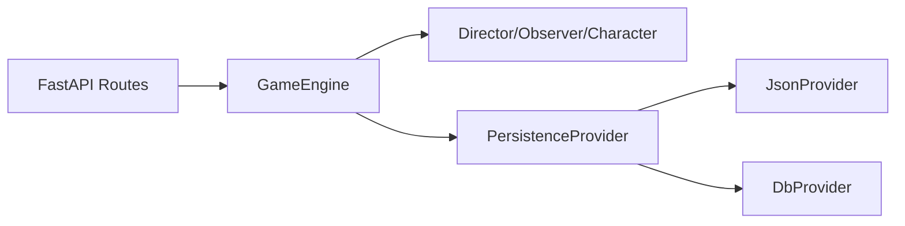
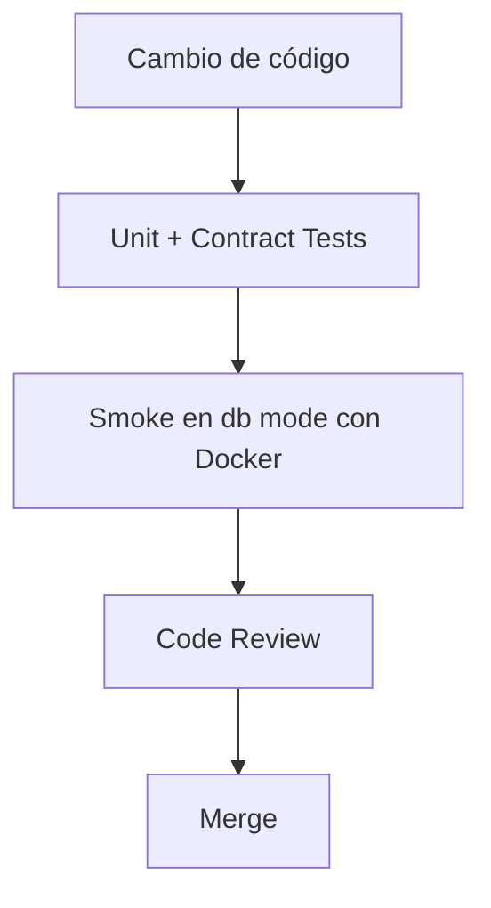

# Engineering Lead Notes

## Objetivo del documento

Definir dirección técnica, prioridades de ejecución y estándares de calidad para evolucionar `Agora` sin comprometer estabilidad ni velocidad de entrega.

## Estado técnico actual (as-is)

- Motor narrativo en Python con orquestación por roles (`Director`, `Guionista`, `Character`, `Observer`).
- API FastAPI + UI estática para pruebas.
- Persistencia dual introducida:
  - `PERSISTENCE_MODE=json`
  - `PERSISTENCE_MODE=db` (PostgreSQL)
- Tests unitarios activos y rápidos.

## Principios de ingeniería

- **Separación de responsabilidades**: lógica narrativa separada de persistencia y transporte.
- **Contratos explícitos**: interfaces claras (`PersistenceProvider`) antes de implementaciones.
- **Fail-fast en infraestructura crítica**: en modo DB, errores de conexión/migración deben abortar arranque.
- **Compatibilidad incremental**: convivir con modo JSON mientras madura DB.
- **Observabilidad primero**: errores de persistencia y latencia visibles en logs.

## Arquitectura técnica objetivo (mediano plazo)

## Estrategia de evolución por fases

## Fase 1 (estabilización)

- Consolidar contrato de persistencia y trazabilidad de errores.
- Endurecer validaciones de entrada/salida en providers.
- Asegurar paridad funcional JSON vs DB en casos core.

## Fase 2 (fiabilidad operativa)

- Instrumentar métricas técnicas:
  - tiempo de turno
  - errores de provider
  - ratio de partidas recuperables
- Mejorar runbooks de recuperación.
- Integrar smoke tests API para flujos críticos.

## Fase 3 (escalado de producto)

- Preparar soporte de multiusuario real (sin hardcode de `usuario`).
- Introducir versionado de esquema de `game_state`.
- Añadir recuperación de partida por API/UI.

## Estrategia de testing

- **Unit tests**: reglas de director/observer/manager y parsing.
- **Contract tests**: mismo suite para `JsonProvider` y `DbProvider`.
- **Integration tests**:
  - creación de partida -> mensajes -> recuperación completa
  - fallback por modo (`json`/`db`)
- **Smoke tests operativos**:
  - arranque en modo `db` con Docker
  - migraciones aplicadas correctamente

## Gestión de deuda técnica

Deuda actual prioritaria:
- documentación técnica dispersa entre README y cambios recientes
- cobertura limitada de escenarios de recuperación de sesión
- necesidad de estandarizar esquema de eventos/mensajes

Mitigación:
- ADRs ligeros para decisiones estructurales
- checklist de PR para cambios de contrato
- política de “no silent failures” en persistencia

## Riesgos técnicos y mitigación

- **Riesgo**: divergencia de comportamiento JSON vs DB.
  - **Mitigación**: tests de contrato + fixtures compartidos.
- **Riesgo**: duplicación de mensajes por hooks de persistencia.
  - **Mitigación**: control por delta y/o idempotencia por message id.
- **Riesgo**: migraciones no idempotentes.
  - **Mitigación**: tabla `schema_migrations` y scripts revisados.
- **Riesgo**: degradación de latencia por DB.
  - **Mitigación**: índices, batching razonable y profiling temprano.

## Gobernanza técnica

- **Definition of Done (DoD)**
  - tests pasan en local/CI
  - contratos no rotos o versionados
  - documentación actualizada en `documents/`
  - logging de errores clave validado
- **Política de releases**
  - cambios de contrato detrás de flags o compatibilidad temporal
  - rollback claro para cambios de persistencia

## Estrategia futura para multiusuario (sin reescritura profunda)

- Mantener `username` en contrato de provider desde ahora.
- Resolver `user_id` en provider DB (hoy `usuario`, mañana token/claims).
- Evitar dependencias de identidad dentro del engine.
- Introducir capa de contexto de request en API cuando llegue auth real.

## Flujo operativo recomendado (dev)

## Referencias

- `README.md`
- `documents/infra.md`
- `documents/product_management.md`
- `src/core/engine.py`
- `src/persistence/`
